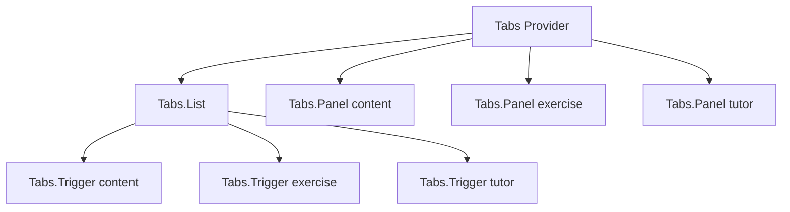

# LIÇÃO 2.1: Component Architecture - React Como Sistema de Composição

## SEÇÃO 1: INTRODUÇÃO (5 minutos)

React não ficou dominante porque inventou HTML em JavaScript. React ficou dominante porque oferece uma unidade arquitetural simples: o componente. O problema é que muitos times tratam componentes como arquivos visuais pequenos, quando deveriam tratá-los como fronteiras de responsabilidade.

Um componente bem desenhado tem contrato claro, composição previsível e custo de mudança baixo. Um componente mal desenhado sabe demais: busca dados, calcula regra de negócio, renderiza UI, decide permissão, dispara analytics, controla modal, conhece rota e ainda tenta ser reutilizável. Funciona na primeira feature. Quebra na terceira.

Nesta lição, vamos olhar para componentes como engineers: não apenas "como renderizar", mas "como organizar variação, estado, extensibilidade e performance sem transformar a UI em massa acoplada".

Ao longo dos exemplos, vamos evoluir partes de uma plataforma educacional: cards de exercícios, quizzes, explicadores do tutor de IA, dialogs e tabs de lições.

---

## SEÇÃO 2: COMPOSIÇÃO VS. HERANÇA (10 minutos)

React escolheu composição porque interfaces são combinações de partes, não árvores rígidas de classes. Em UI real, você raramente quer dizer "QuizCard herda de ExerciseCard que herda de CardBase". Você quer dizer "este card tem header, status, conteúdo, ações e talvez um tutor de IA".

### Anti-pattern: herança mental em componentes

```typescript
type ExerciseCardProps = {
  title: string;
  type: "quiz" | "code" | "essay";
  score?: number;
  codeLanguage?: string;
  essayPrompt?: string;
  onStart: () => void;
};

export function ExerciseCard(props: ExerciseCardProps) {
  return (
    <article className="exercise-card">
      <h3>{props.title}</h3>
      {props.type === "quiz" && <p>Quiz com nota {props.score}</p>}
      {props.type === "code" && <p>Editor: {props.codeLanguage}</p>}
      {props.type === "essay" && <p>{props.essayPrompt}</p>}
      <button onClick={props.onStart}>Começar</button>
    </article>
  );
}
```

O problema não é o `if`. O problema é que o componente virou dono de todas as variações futuras. Cada novo tipo de exercício aumenta o contrato, adiciona props opcionais e amplia o risco de regressão.

### Composição explícita

```typescript
type CardProps = {
  children: React.ReactNode;
};

function ExerciseCard({ children }: CardProps) {
  return <article className="exercise-card">{children}</article>;
}

function ExerciseHeader({ title, badge }: { title: string; badge: string }) {
  return (
    <header>
      <span>{badge}</span>
      <h3>{title}</h3>
    </header>
  );
}

function ExerciseActions({ onStart }: { onStart: () => void }) {
  return <button onClick={onStart}>Começar</button>;
}

export function CodeExerciseCard() {
  return (
    <ExerciseCard>
      <ExerciseHeader title="Refatore o reducer" badge="Código" />
      <p>Abra o editor e reduza estados impossíveis.</p>
      <ExerciseActions onStart={() => console.log("start")} />
    </ExerciseCard>
  );
}
```

Agora o card não precisa conhecer todos os exercícios. Ele oferece estrutura. Os filhos representam variação.

**Trade-off:** composição aumenta o número de peças. Em troca, reduz props opcionais, melhora extensibilidade e facilita teste por parte.

---

## SEÇÃO 3: CONTAINER/PRESENTATIONAL (8 minutos)

O padrão container/presentational é antigo, mas ainda ensina uma fronteira útil: componentes que sabem "como obter e transformar dados" não precisam ser os mesmos que sabem "como mostrar dados".

```typescript
type QuizCardViewProps = {
  title: string;
  totalQuestions: number;
  completedQuestions: number;
  disabled: boolean;
  onContinue: () => void;
};

export function QuizCardView(props: QuizCardViewProps) {
  const progress = `${props.completedQuestions}/${props.totalQuestions}`;

  return (
    <article className="quiz-card">
      <h3>{props.title}</h3>
      <p>{progress} questões respondidas</p>
      <button disabled={props.disabled} onClick={props.onContinue}>
        Continuar
      </button>
    </article>
  );
}

export function QuizCardContainer({ quizId }: { quizId: string }) {
  const quiz = useQuiz(quizId);
  const router = useRouter();

  if (quiz.status === "loading") return <p>Carregando...</p>;
  if (quiz.status === "error") return <p>Erro ao carregar quiz.</p>;

  return (
    <QuizCardView
      title={quiz.data.title}
      totalQuestions={quiz.data.questions.length}
      completedQuestions={quiz.data.completedAnswers}
      disabled={!quiz.data.isUnlocked}
      onContinue={() => router.push(`/quizzes/${quizId}`)}
    />
  );
}
```

Hoje, hooks reduzem a necessidade de containers formais. Mesmo assim, a ideia permanece forte: UI pura é fácil de testar, documentar e reutilizar.

---

## SEÇÃO 4: COMPOUND COMPONENTS (15 minutos)

Compound components são úteis quando várias partes visuais compartilham estado implícito. Exemplos: `Dialog`, `Tabs`, `Accordion`, `Form`, `Select`. O componente pai fornece contexto; os filhos consomem sem receber 12 props em cascata.

### Exemplo: Tabs para uma lição

```typescript
type TabsContextValue = {
  activeTab: string;
  setActiveTab: (id: string) => void;
};

const TabsContext = React.createContext<TabsContextValue | null>(null);

function useTabsContext() {
  const context = React.useContext(TabsContext);
  if (!context) throw new Error("Tabs.* deve ser usado dentro de <Tabs>");
  return context;
}

function Tabs({
  defaultTab,
  children
}: {
  defaultTab: string;
  children: React.ReactNode;
}) {
  const [activeTab, setActiveTab] = React.useState(defaultTab);

  return (
    <TabsContext.Provider value={{ activeTab, setActiveTab }}>
      <div className="tabs">{children}</div>
    </TabsContext.Provider>
  );
}

function TabList({ children }: { children: React.ReactNode }) {
  return <div role="tablist">{children}</div>;
}

function TabTrigger({ id, children }: { id: string; children: React.ReactNode }) {
  const { activeTab, setActiveTab } = useTabsContext();
  return (
    <button
      role="tab"
      aria-selected={activeTab === id}
      onClick={() => setActiveTab(id)}
    >
      {children}
    </button>
  );
}

function TabPanel({ id, children }: { id: string; children: React.ReactNode }) {
  const { activeTab } = useTabsContext();
  if (activeTab !== id) return null;
  return <section role="tabpanel">{children}</section>;
}

Tabs.List = TabList;
Tabs.Trigger = TabTrigger;
Tabs.Panel = TabPanel;

export function LessonWorkspace() {
  return (
    <Tabs defaultTab="content">
      <Tabs.List>
        <Tabs.Trigger id="content">Conteúdo</Tabs.Trigger>
        <Tabs.Trigger id="exercise">Exercício</Tabs.Trigger>
        <Tabs.Trigger id="tutor">Tutor IA</Tabs.Trigger>
      </Tabs.List>
      <Tabs.Panel id="content">Texto da lição...</Tabs.Panel>
      <Tabs.Panel id="exercise">Editor do exercício...</Tabs.Panel>
      <Tabs.Panel id="tutor">Explicação contextual...</Tabs.Panel>
    </Tabs>
  );
}
```

O contrato fica expressivo. Quem lê entende a estrutura. O estado compartilhado não vaza para cada nível da árvore.



**Quando usar:** APIs com subcomponentes coordenados.  
**Quando evitar:** quando props simples resolvem melhor.

---

## SEÇÃO 5: HOCs, RENDER PROPS E HOOKS (8 minutos)

Antes dos hooks, React reutilizava lógica com HOCs e render props. Você ainda vai encontrar esses padrões em bibliotecas e codebases maduras.

| Padrão | Força | Custo |
|---|---|---|
| HOC | Envolve componentes com comportamento transversal | Pode criar árvores difíceis de depurar e colisão de props |
| Render prop | Expõe estado com controle explícito de renderização | Verboso; pode gerar nesting excessivo |
| Hook | Reutiliza lógica stateful com composição simples | Só pode ser usado em componentes/hooks; exige disciplina de dependências |

```typescript
function withAuth<TProps>(Component: React.ComponentType<TProps>) {
  return function AuthenticatedComponent(props: TProps) {
    const user = useCurrentUser();
    if (!user) return <LoginPrompt />;
    return <Component {...props} />;
  };
}

function LessonGate({
  lessonId,
  children
}: {
  lessonId: string;
  children: (state: { allowed: boolean }) => React.ReactNode;
}) {
  const allowed = useLessonAccess(lessonId);
  return <>{children({ allowed })}</>;
}

function useLessonGate(lessonId: string) {
  const user = useCurrentUser();
  const access = useLessonAccess(lessonId);
  return { allowed: Boolean(user && access), user };
}
```

Hooks vencem na maioria dos casos porque deixam a UI visível no componente consumidor. Mas HOCs ainda são úteis em integrações legadas e render props ainda brilham quando a renderização é parte central do contrato.

---

## SEÇÃO 6: PERFORMANCE E RE-RENDERS (10 minutos)

Um render não é bug. React renderiza para descobrir como a UI deveria ficar. O problema é renderização cara, frequente e sem necessidade.

```typescript
function TutorPanel({ messages }: { messages: TutorMessage[] }) {
  const suggestions = messages
    .flatMap((message) => message.concepts)
    .filter((concept, index, all) => all.indexOf(concept) === index);

  return <SuggestionList items={suggestions} />;
}
```

Se `messages` é grande e o painel re-renderiza a cada tecla digitada, o cálculo vira gargalo.

```typescript
function TutorPanel({ messages }: { messages: TutorMessage[] }) {
  const suggestions = React.useMemo(() => {
    return Array.from(new Set(messages.flatMap((message) => message.concepts)));
  }, [messages]);

  return <SuggestionList items={suggestions} />;
}
```

Não use `useMemo` como tempero em tudo. Use quando o cálculo é caro, a referência estável evita trabalho real ou o componente filho depende de igualdade referencial.

```typescript
const ExerciseRow = React.memo(function ExerciseRow({
  exercise,
  onSelect
}: {
  exercise: Exercise;
  onSelect: (id: string) => void;
}) {
  return <button onClick={() => onSelect(exercise.id)}>{exercise.title}</button>;
});

function ExerciseList({ exercises }: { exercises: Exercise[] }) {
  const [selectedId, setSelectedId] = React.useState<string | null>(null);

  const handleSelect = React.useCallback((id: string) => {
    setSelectedId(id);
  }, []);

  return exercises.map((exercise) => (
    <ExerciseRow key={exercise.id} exercise={exercise} onSelect={handleSelect} />
  ));
}
```

Aqui, `useCallback` só faz sentido porque `ExerciseRow` está memoizado e recebe `onSelect`. Sem isso, seria cerimônia vazia.

---

## QUIZ

1. **Multiple choice:** Por que composição é preferida a herança em React?  
   A. Porque herança não existe em JavaScript.  
   B. Porque UI muda por combinação de partes, e composição reduz hierarquias rígidas.  
   C. Porque composição sempre tem melhor performance.  
   D. Porque hooks exigem composição.

2. **Short answer:** Quando o padrão container/presentational ainda é útil?

3. **Code review:** Um `CourseCard` recebe 22 props, incluindo `showAdminActions`, `quizScore`, `essayStatus`, `aiExplanation`, `onRetry`, `onPublish`, `onArchive`. Qual sinal arquitetural aparece?

4. **Prediction:** Se um componente pai cria `const onClick = () => select(id)` a cada render e passa para um filho com `React.memo`, o filho pode re-renderizar? Por quê?

5. **Multiple choice:** Compound components são mais indicados para:  
   A. Qualquer botão simples.  
   B. Componentes com subpartes coordenadas por estado compartilhado.  
   C. Substituir todos os hooks.  
   D. Evitar Context API sempre.

---

## EXERCÍCIO PRÁTICO

Refatore um componente acoplado de `ExerciseWorkspace` para compound component.

### Código inicial

```typescript
type ExerciseWorkspaceProps = {
  activeTab: "instructions" | "editor" | "result";
  onTabChange: (tab: "instructions" | "editor" | "result") => void;
  instructions: string;
  code: string;
  result?: string;
  onRun: () => void;
};

export function ExerciseWorkspace(props: ExerciseWorkspaceProps) {
  return (
    <section>
      <button onClick={() => props.onTabChange("instructions")}>Instruções</button>
      <button onClick={() => props.onTabChange("editor")}>Editor</button>
      <button onClick={() => props.onTabChange("result")}>Resultado</button>
      {props.activeTab === "instructions" && <p>{props.instructions}</p>}
      {props.activeTab === "editor" && <textarea value={props.code} readOnly />}
      {props.activeTab === "result" && <pre>{props.result}</pre>}
      <button onClick={props.onRun}>Executar</button>
    </section>
  );
}
```

### Objetivo

Criar uma API:

```typescript
<ExerciseWorkspace defaultTab="instructions">
  <ExerciseWorkspace.Tabs />
  <ExerciseWorkspace.Panel id="instructions">...</ExerciseWorkspace.Panel>
  <ExerciseWorkspace.Panel id="editor">...</ExerciseWorkspace.Panel>
  <ExerciseWorkspace.Panel id="result">...</ExerciseWorkspace.Panel>
  <ExerciseWorkspace.Actions onRun={runCode} />
</ExerciseWorkspace>
```

Critérios: estado compartilhado via contexto, erro claro quando usado fora do provider, `aria-selected` nos triggers e nenhum conhecimento rígido sobre o conteúdo dos painéis.

## RESUMO

Component architecture é design de contratos. Componentes bons aceitam mudança sem crescer em todas as direções. Composição reduz hierarquias rígidas. Containers isolam dados. Compound components criam APIs expressivas para UI coordenada. Hooks são a forma moderna de reutilizar lógica, mas entender HOCs e render props ajuda a ler sistemas reais. Performance começa com medição e com fronteiras claras, não com memoização reflexa.
