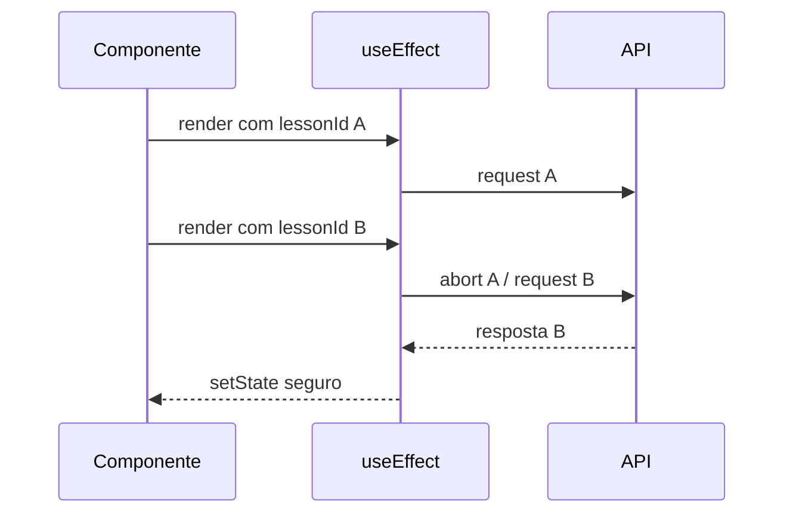

# LIÇÃO 2.2: Hooks Profundo - useReducer, Context e Custom Hooks

## SEÇÃO 1: INTRODUÇÃO (5 minutos)

Hooks parecem simples no começo: `useState`, `useEffect`, talvez `useContext`. O problema aparece quando o componente deixa de ter um estado e passa a ter um fluxo. Loading, erro, cache, tentativa de retry, feedback do usuário, cancelamento de requisição e dados derivados começam a se misturar.

Nesta lição, vamos tratar hooks como ferramenta arquitetural. O objetivo não é decorar APIs, mas escolher a menor estrutura que representa corretamente o problema.

O caso central será o tutor de IA da plataforma educacional: o aluno envia uma dúvida sobre uma lição, recebe uma explicação, pode avaliar a resposta e o sistema evita chamadas duplicadas quando já existe cache.

---

## SEÇÃO 2: useState VS. useReducer (10 minutos)

`useState` brilha quando o estado é simples e independente.

```typescript
function TutorQuestionBox() {
  const [question, setQuestion] = React.useState("");

  return (
    <textarea
      value={question}
      onChange={(event) => setQuestion(event.target.value)}
      placeholder="Pergunte ao tutor..."
    />
  );
}
```

Quando múltiplos valores mudam juntos, `useState` começa a permitir estados impossíveis.

```typescript
function TutorPanel() {
  const [answer, setAnswer] = React.useState<string | null>(null);
  const [isLoading, setIsLoading] = React.useState(false);
  const [error, setError] = React.useState<string | null>(null);

  async function ask(question: string) {
    setIsLoading(true);
    setError(null);
    try {
      const response = await fetchTutorAnswer(question);
      setAnswer(response.answer);
    } catch {
      setError("Não foi possível gerar a explicação.");
    } finally {
      setIsLoading(false);
    }
  }
}
```

Esse código é aceitável, mas permite combinações estranhas: `isLoading === true` com `error` preenchido e `answer` antigo aparecendo. `useReducer` melhora quando estado muda por eventos nomeados.

```typescript
type TutorState =
  | { status: "idle"; answer: null; error: null }
  | { status: "loading"; answer: null; error: null }
  | { status: "success"; answer: string; error: null }
  | { status: "error"; answer: null; error: string };

type TutorAction =
  | { type: "ASK_STARTED" }
  | { type: "ASK_SUCCEEDED"; answer: string }
  | { type: "ASK_FAILED"; error: string }
  | { type: "RESET" };

function tutorReducer(state: TutorState, action: TutorAction): TutorState {
  switch (action.type) {
    case "ASK_STARTED":
      return { status: "loading", answer: null, error: null };
    case "ASK_SUCCEEDED":
      return { status: "success", answer: action.answer, error: null };
    case "ASK_FAILED":
      return { status: "error", answer: null, error: action.error };
    case "RESET":
      return { status: "idle", answer: null, error: null };
    default:
      return state;
  }
}
```

Agora o estado comunica o domínio. Não existe "loading com error antigo", porque o tipo não deixa.

---

## SEÇÃO 3: CUSTOM HOOKS COMO FRONTEIRA (10 minutos)

Custom hooks não são apenas "funções com use". Eles são fronteiras para lógica stateful. Um bom hook tem nome de caso de uso, contrato pequeno e retorno previsível.

```typescript
export function useAiTutor(lessonId: string) {
  const [state, dispatch] = React.useReducer(tutorReducer, {
    status: "idle",
    answer: null,
    error: null
  });

  const ask = React.useCallback(
    async (question: string) => {
      dispatch({ type: "ASK_STARTED" });
      try {
        const response = await fetch("/api/tutor", {
          method: "POST",
          headers: { "Content-Type": "application/json" },
          body: JSON.stringify({ lessonId, question })
        });

        if (!response.ok) throw new Error("Tutor request failed");
        const data = (await response.json()) as { answer: string };
        dispatch({ type: "ASK_SUCCEEDED", answer: data.answer });
      } catch {
        dispatch({
          type: "ASK_FAILED",
          error: "Não foi possível gerar a explicação agora."
        });
      }
    },
    [lessonId]
  );

  return { state, ask };
}
```

O componente fica menor:

```typescript
function AiTutorExplainer({ lessonId }: { lessonId: string }) {
  const { state, ask } = useAiTutor(lessonId);
  const [question, setQuestion] = React.useState("");

  return (
    <section>
      <textarea value={question} onChange={(event) => setQuestion(event.target.value)} />
      <button onClick={() => ask(question)}>Perguntar</button>
      {state.status === "loading" && <p>Gerando explicação...</p>}
      {state.status === "error" && <p>{state.error}</p>}
      {state.status === "success" && <p>{state.answer}</p>}
    </section>
  );
}
```

---

## SEÇÃO 4: CONTEXT SEM REDUX (8 minutos)

Context é suficiente quando o estado é moderadamente global, muda com baixa frequência e não exige debugging sofisticado. Tema, usuário autenticado, permissões e preferências são bons candidatos.

```typescript
type AuthUser = { id: string; name: string; role: "student" | "admin" };

type AuthContextValue = {
  user: AuthUser | null;
  refresh: () => Promise<void>;
  signOut: () => Promise<void>;
};

const AuthContext = React.createContext<AuthContextValue | null>(null);

export function useAuth() {
  const context = React.useContext(AuthContext);
  if (!context) throw new Error("useAuth deve ser usado dentro de AuthProvider");
  return context;
}
```

Context não é automaticamente "estado global bom". Se um valor muda a cada tecla, todos os consumidores podem re-renderizar. Divida contextos por frequência de mudança e responsabilidade.

---

## SEÇÃO 5: useEffect PITFALLS (12 minutos)

`useEffect` sincroniza seu componente com sistemas externos: rede, subscriptions, timers, DOM fora do React. Ele não deve ser o lugar padrão para calcular dados derivados.

### Dependência ausente

```typescript
function LessonProgress({ lessonId }: { lessonId: string }) {
  const [progress, setProgress] = React.useState<number | null>(null);

  React.useEffect(() => {
    fetchProgress(lessonId).then(setProgress);
  }, []); // bug: lessonId mudou, efeito não roda

  return <p>{progress}%</p>;
}
```

Corrija dependências:

```typescript
React.useEffect(() => {
  fetchProgress(lessonId).then(setProgress);
}, [lessonId]);
```

### Race condition

Se `lessonId` muda rapidamente, a resposta antiga pode chegar depois e sobrescrever a nova.

```typescript
React.useEffect(() => {
  const controller = new AbortController();

  async function load() {
    const response = await fetch(`/api/lessons/${lessonId}/progress`, {
      signal: controller.signal
    });
    const data = await response.json();
    setProgress(data.percentage);
  }

  load().catch((error) => {
    if (error.name !== "AbortError") setError("Falha ao carregar progresso");
  });

  return () => controller.abort();
}, [lessonId]);
```



---

## SEÇÃO 6: useMemo E useCallback (8 minutos)

Memoização tem custo: memória, complexidade e dependências. Use quando há cálculo caro, estabilidade referencial necessária ou componente filho memoizado.

| Situação | Ferramenta | Decisão |
|---|---|---|
| Cálculo barato | Nenhuma | Recalcular é mais simples |
| Filtrar lista grande | useMemo | Útil se inputs mudam pouco |
| Handler passado para filho memoizado | useCallback | Pode evitar render do filho |
| Corrigir bug de lógica | Nenhuma | Memoização não corrige design |

Árvore de decisão:

```text
Existe lentidão medida?
  não -> não memorize
  sim -> o custo está em cálculo?
    sim -> useMemo
    não -> está em filho memoizado recebendo função/objeto instável?
      sim -> useCallback/useMemo para estabilizar referência
      não -> revise arquitetura e volume de renderização
```

---

## QUIZ

1. **Multiple choice:** Quando `useReducer` é melhor que vários `useState`?  
   A. Sempre.  
   B. Quando estados mudam por eventos relacionados e há combinações inválidas a evitar.  
   C. Apenas quando há Redux.  
   D. Quando o componente não renderiza JSX.

2. **Short answer:** Por que custom hooks são fronteiras arquiteturais?

3. **Debugging:** Um `useEffect` busca dados por `lessonId`, mas o array de dependências está vazio. Qual bug aparece?

4. **Prediction:** Uma resposta antiga de API pode sobrescrever uma resposta nova? Em qual cenário?

5. **Code review:** Um Context contém `questionDraft`, `setQuestionDraft`, `user`, `theme`, `notifications` e muda a cada tecla. Qual risco?

---

## EXERCÍCIO PRÁTICO

Implemente `useAuthSession` com refresh token.

Requisitos: estado via `useReducer`, estados `checking`, `authenticated`, `anonymous`, `refreshing` e `error`; função `refreshSession`; cleanup de request com `AbortController`; hook `useAuth` que falha se usado fora do provider; validação de que erro de refresh não deixa usuário antigo autenticado.

## RESUMO

`useState` resolve estado simples. `useReducer` modela transições. Context distribui estado, mas não substitui arquitetura. Custom hooks encapsulam lógica stateful com contratos claros. `useEffect` sincroniza com o mundo externo e precisa de dependências e cleanup. Memoização é ferramenta cirúrgica: aplique onde há custo real.
