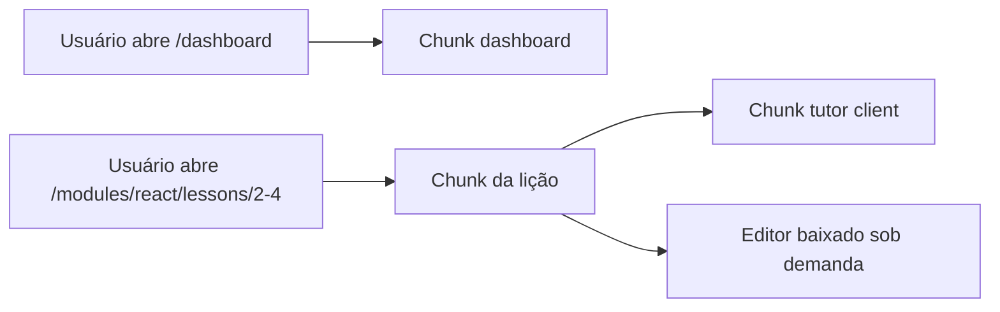

# LIÇÃO 2.4: Routing & Code Splitting - Next.js App Router

## SEÇÃO 1: INTRODUÇÃO (5 minutos)

Em aplicações Next.js modernas, rota não é apenas URL. Rota define fronteira de carregamento, layout compartilhado, tratamento de erro, metadata, streaming e divisão de código. Um engineer olha para a árvore `app/` como mapa de produto e mapa de performance ao mesmo tempo.

Esta lição usa App Router, não Pages Router. A plataforma educacional terá rotas para dashboard, módulos, lições e admin.

---

## SEÇÃO 2: ESTRUTURA DE PROJETO (8 minutos)

Uma estrutura saudável deixa produto e responsabilidade visíveis.

```text
app/
  layout.tsx
  page.tsx
  dashboard/
    page.tsx
    loading.tsx
  modules/
    layout.tsx
    [moduleId]/
      page.tsx
      lessons/
        [lessonId]/
          page.tsx
          loading.tsx
          error.tsx
  admin/
    layout.tsx
    page.tsx
components/
  lesson/
  tutor/
lib/
  auth.ts
  lessons.ts
```

`layout.tsx` persiste entre navegações dentro do segmento. `page.tsx` é a tela daquela rota. `loading.tsx` define estado de carregamento. `error.tsx` captura erro do segmento.

---

## SEÇÃO 3: LAYOUTS NESTED (8 minutos)

O layout raiz define estrutura global.

```typescript
// app/layout.tsx
import type { Metadata } from "next";
import "./globals.css";

export const metadata: Metadata = {
  title: "Engineering LMS",
  description: "Plataforma educacional com tutor de IA"
};

export default function RootLayout({ children }: { children: React.ReactNode }) {
  return (
    <html lang="pt-BR">
      <body>
        <main>{children}</main>
      </body>
    </html>
  );
}
```

Layout de módulos:

```typescript
// app/modules/layout.tsx
import { ModuleSidebar } from "@/components/lesson/module-sidebar";

export default function ModulesLayout({ children }: { children: React.ReactNode }) {
  return (
    <div className="module-shell">
      <ModuleSidebar />
      <section>{children}</section>
    </div>
  );
}
```

Isso evita repetir sidebar em cada página. A decisão é arquitetural: tudo dentro de `/modules` compartilha contexto de aprendizagem.

---

## SEÇÃO 4: SERVER VS CLIENT COMPONENTS (10 minutos)

No App Router, componentes são Server Components por padrão. Eles podem buscar dados no servidor, acessar banco e reduzir JavaScript enviado ao browser. Client Components são necessários para interatividade: estado, eventos, effects e APIs do browser.

```typescript
// app/modules/[moduleId]/lessons/[lessonId]/page.tsx
import { getLesson } from "@/lib/lessons";
import { AiTutorClient } from "@/components/tutor/ai-tutor-client";

export default async function LessonPage({
  params
}: {
  params: Promise<{ moduleId: string; lessonId: string }>;
}) {
  const { lessonId } = await params;
  const lesson = await getLesson(lessonId);

  return (
    <article>
      <h1>{lesson.title}</h1>
      <div dangerouslySetInnerHTML={{ __html: lesson.html }} />
      <AiTutorClient lessonId={lesson.id} />
    </article>
  );
}
```

Client Component:

```typescript
// components/tutor/ai-tutor-client.tsx
"use client";

export function AiTutorClient({ lessonId }: { lessonId: string }) {
  const [question, setQuestion] = React.useState("");

  return (
    <section>
      <textarea value={question} onChange={(event) => setQuestion(event.target.value)} />
      <button>Perguntar</button>
    </section>
  );
}
```

Regra prática: busque dados e renderize conteúdo estático no servidor; isole interatividade em ilhas client.

---

## SEÇÃO 5: LOADING, ERROR E METADATA (8 minutos)

```typescript
// app/modules/[moduleId]/lessons/[lessonId]/loading.tsx
export default function LoadingLesson() {
  return <p>Carregando lição...</p>;
}
```

```typescript
// app/modules/[moduleId]/lessons/[lessonId]/error.tsx
"use client";

export default function LessonError({
  error,
  retry
}: {
  error: Error;
  retry: () => void;
}) {
  return (
    <section>
      <h2>Não foi possível carregar a lição</h2>
      <p>{error.message}</p>
      <button onClick={retry}>Tentar novamente</button>
    </section>
  );
}
```

Metadata dinâmica:

```typescript
import type { Metadata } from "next";

export async function generateMetadata({
  params
}: {
  params: Promise<{ lessonId: string }>;
}): Promise<Metadata> {
  const { lessonId } = await params;
  const lesson = await getLesson(lessonId);
  return {
    title: `${lesson.title} | Engineering LMS`,
    description: lesson.description
  };
}
```

---

## SEÇÃO 6: CODE SPLITTING (8 minutos)

Next.js divide código por rota automaticamente. O usuário que abre dashboard não precisa baixar o editor pesado do exercício se ele só existe na rota da lição.

Para componentes pesados dentro da mesma rota, use import dinâmico.

```typescript
import dynamic from "next/dynamic";

const CodeEditor = dynamic(() => import("@/components/lesson/code-editor"), {
  loading: () => <p>Carregando editor...</p>
});

export function ExerciseArea({ starterCode }: { starterCode: string }) {
  return <CodeEditor initialValue={starterCode} />;
}
```



Code splitting não corrige componente gigante compartilhado em todo layout. Se você importa biblioteca pesada no `app/layout.tsx`, ela pode afetar tudo.

---

## QUIZ

1. **Multiple choice:** No App Router, componentes são por padrão: Server ou Client?
2. **Short answer:** Quando usar `"use client"`?
3. **Code review:** Um editor Monaco é importado no layout raiz. Qual risco?
4. **Prediction:** O que acontece com `layout.tsx` durante navegação entre páginas do mesmo segmento?
5. **Multiple choice:** `error.tsx` no App Router precisa ser Client Component porque:
   A. Todo erro é client-side.  
   B. Ele recebe `retry`, que é handler interativo.  
   C. Metadata exige client.  
   D. loading.tsx também exige client.

---

## EXERCÍCIO PRÁTICO

Adicione a rota `app/modules/[moduleId]/overview/page.tsx` com layout compartilhado de módulo.

Critérios: usar Server Component para buscar módulo; incluir `loading.tsx`; criar `generateMetadata`; manter widgets interativos em componente client separado; não importar editor pesado na overview.

## RESUMO

App Router transforma rotas em fronteiras de arquitetura. Layouts reduzem repetição e preservam UI compartilhada. Server Components reduzem JavaScript no cliente. Client Components devem ser ilhas interativas. Code splitting funciona melhor quando você respeita fronteiras de rota e evita dependências pesadas em layouts globais.
